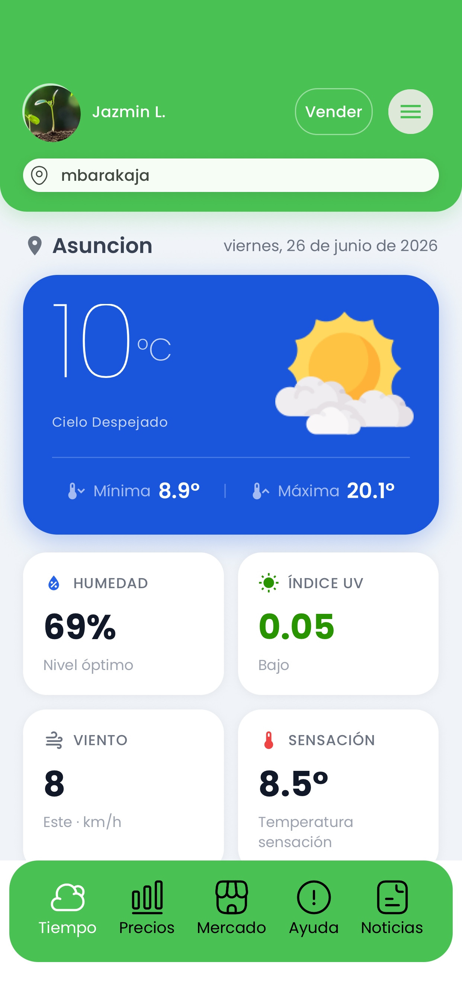
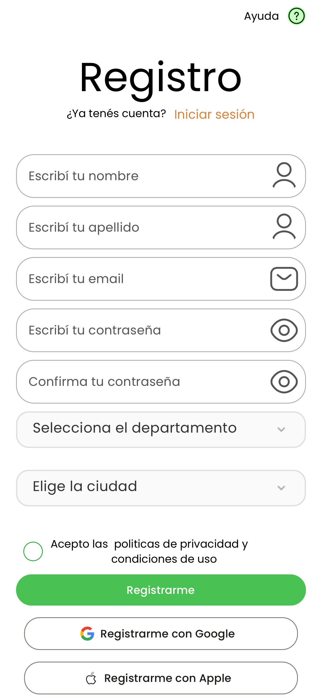
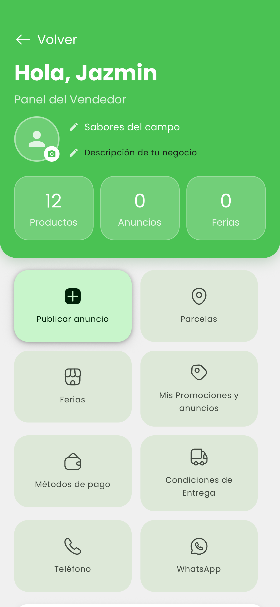
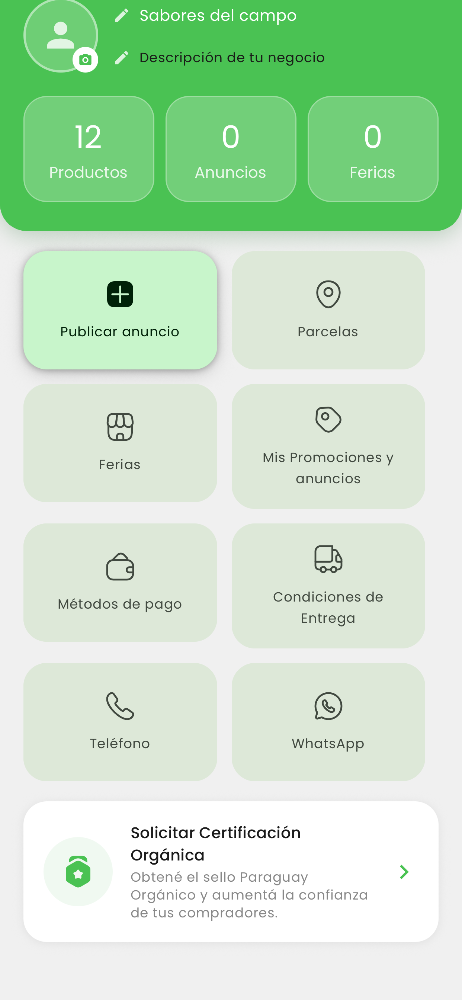
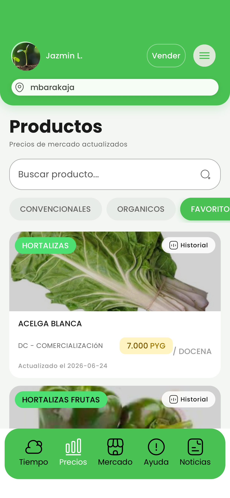
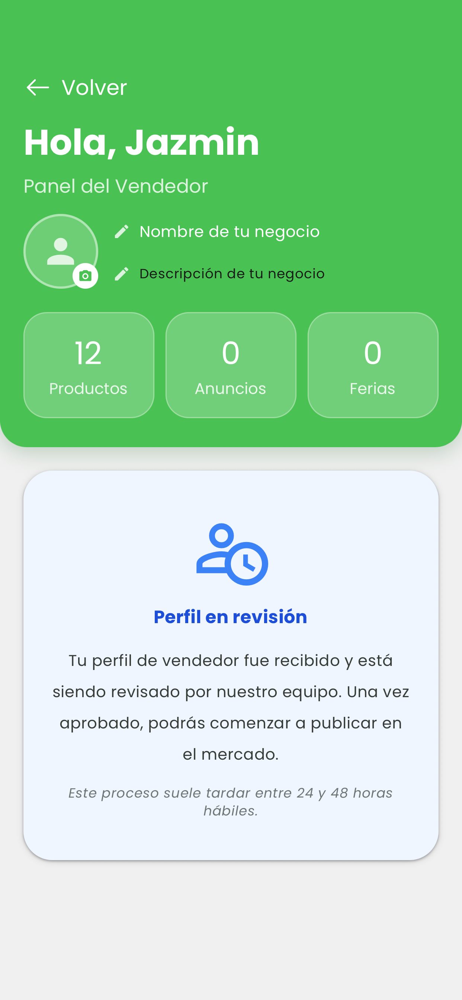
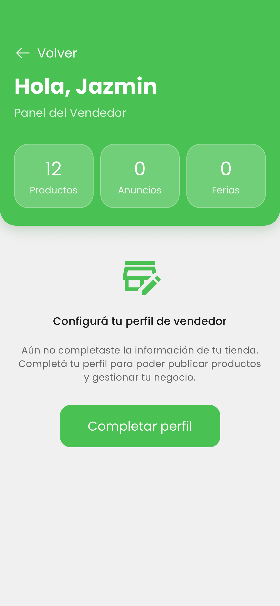

# agroarandu-showcase
AgroArandu es una plataforma digital orientada a pequeños productores agrícolas que facilita la gestión de sus parcelas y les brinda acceso a información relevante del sector, incluyendo noticias, precios de mercado y un marketplace para la oferta y comercialización de sus productos.
La plataforma está compuesta por:

Backend desarrollado en Laravel
Panel de administración web
Aplicación móvil en React Native

## Infraestructura

El sistema está containerizado utilizando **Docker**, lo que permite un entorno de desarrollo y despliegue consistente entre diferentes máquinas y servidores.

La arquitectura se compone de tres servicios principales orquestados mediante Docker Compose:

- **Backend (Laravel)**: API principal que centraliza la lógica de negocio del sistema.
- **Base de datos**: Servicio de persistencia de datos.
- **Precios del MAG (Ministerio de agricultura y ganadería)**: Servicio independiente encargado de la obtención y procesamiento de precios del MAG.

Este último servicio utiliza scripts en **Python** para procesar información proveniente de un buzón de correo designado, transformando los datos de precios y volcándolos posteriormente a la base de datos del sistema.

## Arquitectura

El sistema está construido sobre un backend centralizado en **Laravel**, que expone una API REST consumida por una aplicación móvil desarrollada en **React Native** y un panel web de administración.

Además, el sistema integra servicios externos para la obtención de información de mercado y gestión de datos agrícolas.

## Backend

El backend implementa la generación de contenido multimedia mediante **FFmpeg**, utilizado para extraer fotogramas de videos subidos por los vendedores. Estos fotogramas se emplean como imágenes de portada o preview en los anuncios del marketplace.

Asimismo, se realiza compresión de imágenes para optimizar el almacenamiento y mejorar el rendimiento del sistema.

## Panel de administración

El panel web está orientado a usuarios administradores y operadores del sistema.

Permite:

- Gestión de usuarios y roles
- Administración general de la plataforma
- Registro y actualización de precios de mercado
- Supervisión de anuncios publicados desde la aplicación móvil
- Eliminación o moderación de publicaciones realizadas por vendedores

## Aplicación móvil

Aplicación desarrollada en **React Native** destinada a productores y vendedores agrícolas.

Incluye funcionalidades como:

- Recepción de notificaciones push (noticias, alertas meteorológicas y cambios de precios)
- Registro y gestión de parcelas agrícolas
- Publicación de anuncios en el marketplace
- Exploración de productos publicados por otros usuarios
- Visualización de perfiles de vendedores, datos de contacto y catálogo de productos

## API
La API gestiona los principales módulos del sistema:

- Autenticación y gestión de perfil de usuario
- Gestión de parcelas agrícolas
- Gestión de perfil de vendedor
- Publicación y administración de anuncios del marketplace
- Consulta de precios de mercado
- Noticias y alertas del sector
- Notificaciones push

## Screenshots

## Videos

<video controls width="100%">
  <source src="videos/intro.mov" type="video/quicktime">
  Tu navegador no soporta la reproducción de videos.
</video>

<video controls width="100%">
  <source src="videos/editar%20anuncio.mov" type="video/quicktime">
  Tu navegador no soporta la reproducción de videos.
</video>

<video controls width="100%">
  <source src="videos/ver%20market.mov" type="video/quicktime">
  Tu navegador no soporta la reproducción de videos.
</video>
